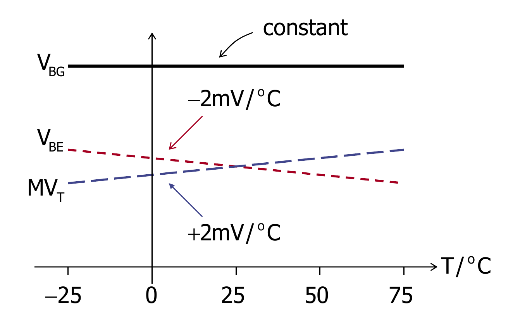
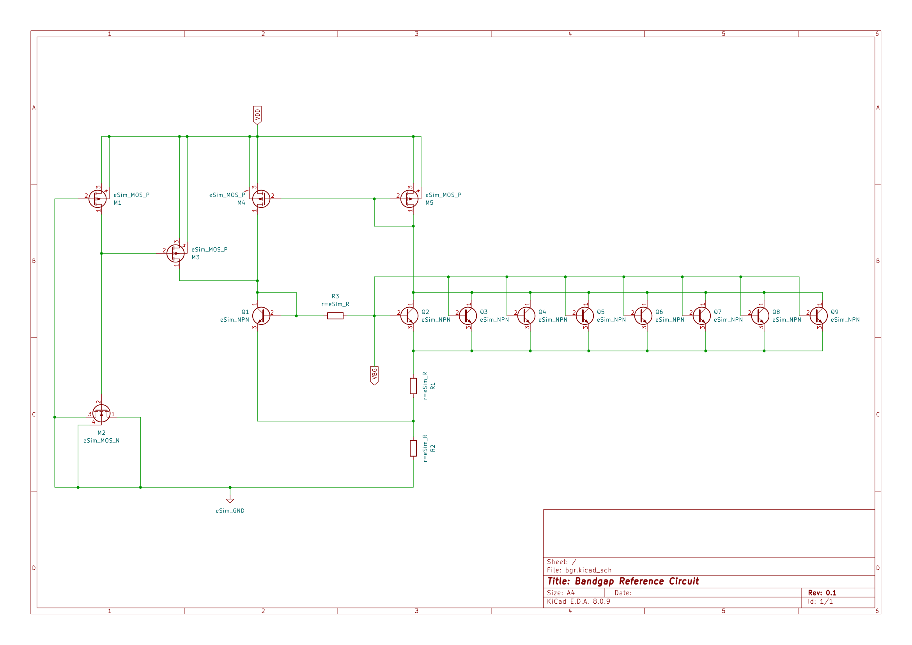
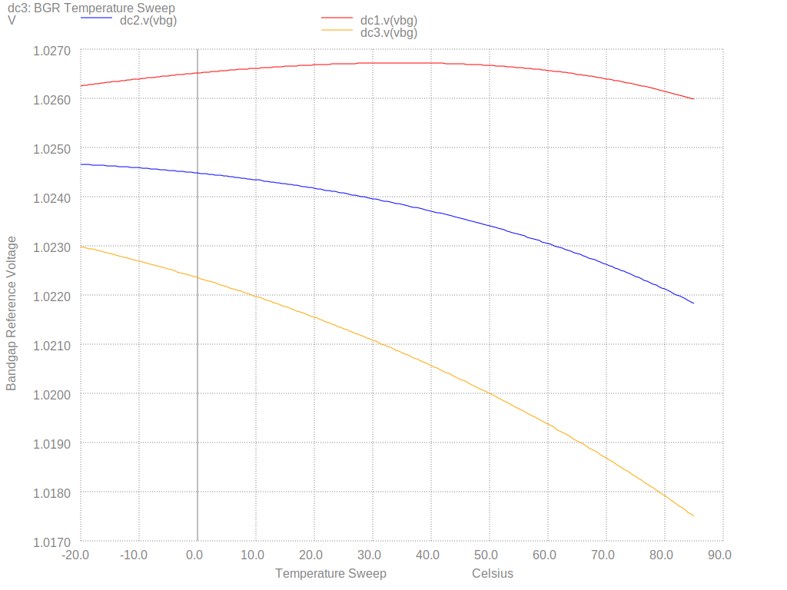
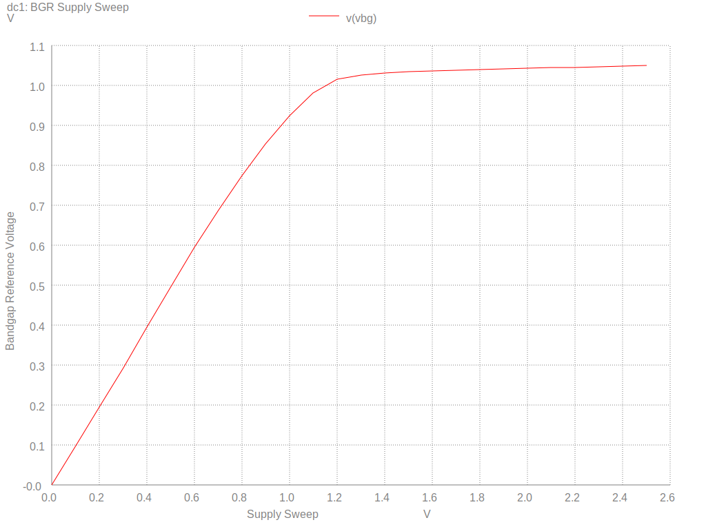
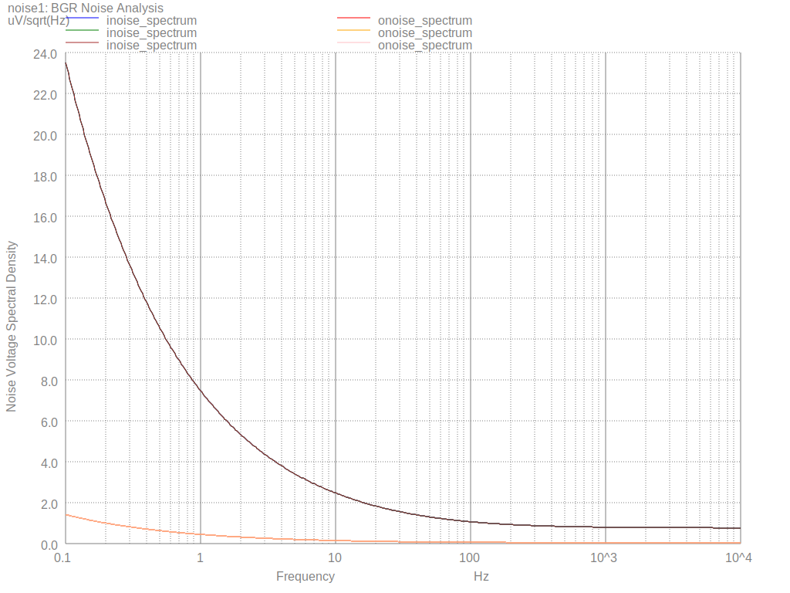
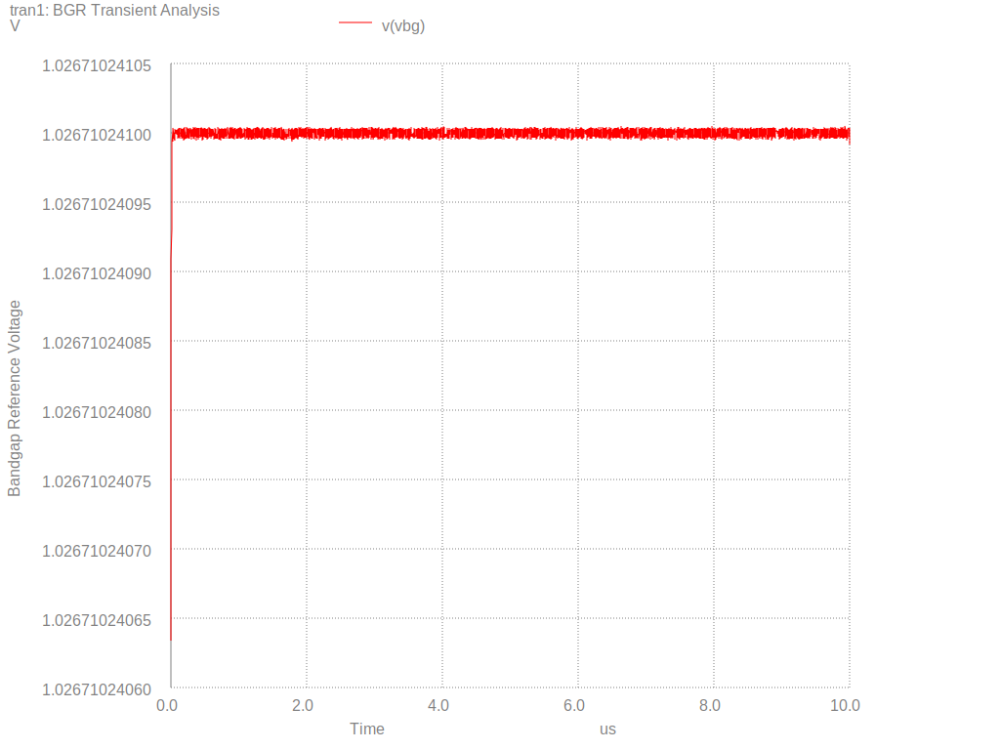
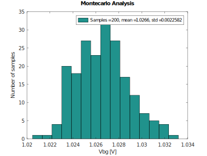

# Bandgap-Reference-Circuit
Bandgap Reference Circuit Design Using IHP 130nm BiCMOS Open Source PDK And eSim

### eSIM Marathon - Circuit Design & Simulation with IHP SG13G2


### Table of contents
  * [Abstract](#abstract)
  * [Tools Used](#tools-used)
  * [BGR Introduction](#bgr-introduction)

## Abstract
The design of 1V bandgap reference (BGR) circuit using silicon-germanium heterojunction bipolar transistor (SiGe-HBT) from IHP 130nm BiCMOS open source PDK. The circuit operates with temperature coefficient (TC) of 6.85ppm/ºC in the temperature range of -20ºC to 85ºC at 1.3V supply.

## Tools Used
### eSim:
eSim is an open source EDA tool for circuit design, simulation, analysis and PCB design, developed by FOSSEE Team at IIT Bombay. It is an integrated tool build using open source softwares such as KiCad, Ngspice and GHDL.</br>
Download Link: https://esim.fossee.in/downloads

### IHP Open Source PDK: 
130nm BiCMOS Open Source PDK, dedicated for Analog/Digital, Mixed Signal and RF Design.</br>
Download Link: https://github.com/IHP-GmbH/IHP-Open-PDK </br>
Installation Guide: https://ihp-open-pdk-docs.readthedocs.io/en/latest/install.html

### OpenVAF:
OpenVAF is a Verilog-A compiler that can compile Verilog-A files for use in circuit simulator.</br>
Download Link: https://openvaf.semimod.de/download

### NGSPICE: 
Ngspice is a mixed-level/mixed-signal circuit simulator. Its code is based on three open source software packages: Spice3f5, Cider1b1 and Xspice.</br>
Download Link: https://sourceforge.net/p/ngspice/ngspice/ci/master/tree </br>
Installation Guide: https://ihp-open-pdk-docs.readthedocs.io/en/latest/analog/ngspice.html

### GNU Octave:
GNU Octave is a scientific programming language for scientific computing and numerical computation.</br>
Download Link: https://octave.org/download 

## BGR Introduction
Bandgap regerence circuit (BGR) is a voltage reference circuit which generates constant voltage, independent of temperature, supply and process variation. This voltage composed of complementary to absolute temperature (CTAT) and proportional to  absolute temperature (PTAT) voltage and/or current components. Correct proportion of this components produce constant voltage. V<sub>BE</sub> and V<sub>T</sub> in the BJT current equation produces CTAT and PTAT voltages respectively.</br>
`Equation1:` $V_{BG} = V_{BE} + MV_T$

``Image Source: Reference 2``
## Circuit Schematic in eSim


## Circuit Calculations
### Component Description:
| Sl No. | Name          | Description           | Values         |
| :---:  | :---          | :---                  | :---           |
| 1      | `XM1`         | Startup Circuit PMOS  | W=1u, L=5u     |
| 2      | `XM2`         | Startup Circuit NMOS  | W=10u, L=10u   |
| 3      | `XM3`         | Startup Circuit PMOS  | W=4u, L=1u     |
| 4      | `XM4`,`XM5`   | Current Mirror PMOS   | W=9.5u, L=1.5u |
| 5      | `XQ1`to`XQ9`  | NPN HBT               | Nx=1           |
| 6      | `XR1`         | 5.3k Resistor         | W=0.5u, L=1.7u |
| 7      | `XR2`         | 15.7k Resistor        | W=0.5u, L=5.1u |
| 8      | `XR3`         | 2k Resistor           | W=0.5u, L=0.6u |


### Step 1: PMOS Current Mirror
For Calculating PMOS `XM4` and `XM5` W and L values. Considering I<sub>D</sub> = 10uA, V<sub>OV</sub> = 0.15V and μ<sub>p</sub>​C<sub>ox</sub> = 0.14mA/V<sup>2</sup>.</br>
`Equation2:` $\frac{W}{L}≈\frac{2 I_D}{μ_p C_ox V_{ov}^2}​​≈6.34$</br>
Choosing L=1.5u results in W=9.5u

### Step 2: Startup Circuit
The P-startup circuit is used. Usually the sizing for `XM1` and `XM3` are WIDE and for `XM2` is LONG. 

### Step 3: NPN HBT
IHP's npn13G2 with no of emitter Nx=1 are used for components `XQ1` to `XQ9`. 8 HBT's are choosen `XQ2` to `XQ9` for better matching and common centroid layout.

### Step 4: Resistor Value 
`Equation 3:` $V_T ln(8) = I_E /left(R_1 + /frac{R_3/{β+1} /right)$</br>
Ignore R<sub>3</sub> component in the equation 3 results in R<sub>1</sub>=5.3kΩ.</br>
</br>
`Equation 4:` $V_{BG} = V_{BE1} + I_E (R_1 + 2R_2)$</br>
For V<sub>BG</sub>=1V and V<sub>BE1</sub>=0.63V, results in R<sub>2</sub>=15.7kΩ.</br>
</br>
The parameter sweep of `XR3` reistor with values 2k, 30k and 60k are used in temperature sweep and noise analysis.

## BGR Netlist
The netlist `bgr.cir.out` contains the BGR circuit core without stimulus and library in the sub-circuit format. The stimulus, library and result generation are included in respective analysis file.
```
.subckt bgr vdd vbg gnd

*MOS subcircuit drain gate source bulk
xm1 net1 gnd vdd vdd sg13_lv_pmos w=1u l=5u ng=1 m=1
xm2 gnd net1 gnd gnd sg13_lv_nmos w=10u l=10u ng=1 m=1
xm3 net2 net1 vdd vdd sg13_lv_pmos w=4u l=1u ng=1 m=1
xm4 net2 net3 vdd vdd sg13_lv_pmos w=9.5u l=1.5u ng=1 m=1
xm5 net3 net3 vdd vdd sg13_lv_pmos w=9.5u l=1.5u ng=1 m=1

*NPN HBT subcircuit collector base emitter subc
xq1 net2 net2 net4 gnd npn13G2 Nx=1
xq2 net3 vbg net5 gnd npn13G2 Nx=1
xq3 net3 vbg net5 gnd npn13G2 Nx=1
xq4 net3 vbg net5 gnd npn13G2 Nx=1
xq5 net3 vbg net5 gnd npn13G2 Nx=1
xq6 net3 vbg net5 gnd npn13G2 Nx=1
xq7 net3 vbg net5 gnd npn13G2 Nx=1
xq8 net3 vbg net5 gnd npn13G2 Nx=1
xq9 net3 vbg net5 gnd npn13G2 Nx=1

*Resistor subcircuit P1 P2 bulk
xr1 net5 net4 gnd rhigh w=0.5u l=1.7u m=1
xr2 net4 gnd gnd rhigh w=0.5u l=5.1u m=1
xr3 net2 vbg gnd rhigh w=0.5u l={resL} m=1

.ends
```

## Simulations
### DC: Temperature Sweep 
Temperature sweep from -20ºC to 85ºC show stable BRG voltage of 1.02V for `XR3` reistor value 2k at 1.3V supply.

The `R3` reistor values 2k, 30k and 60k are used in the temperature sweep. Below are the resultant temperature coefficient (TC) respectively.
```
--------------------------------------------------------------------------------
Index   tempcoff        
--------------------------------------------------------------------------------
0	6.856214e+00	
1	2.631005e+01	
2	5.119615e+01	
```

### DC: Supply Sweep
A stable BRG voltage of 1.V is observed in supply sweep from 1.3V to 2.5V show for `XR3` reistor value 2k.


### NOISE: Noise Analysis

The parameter sweep of `XR3` reistor with values 2k, 30k and 60k are used in noise analysis. Below are the resultant input and output refered total noise voltage respectively.
```
--------------------------------------------------------------------------------
Index   outreftotalnois inreftotalnoise 
--------------------------------------------------------------------------------
0	4.858997e-06	8.082027e-05	
1	7.119791e-06	1.215717e-04	
2	1.057774e-05	1.855346e-04	
```

### TRAN: Transient Analysis


### MC: Monte-Carlo Analysis
Montecarlo analysis of 200 samples with process variation results in `mean = 1.02V` and `standard deviation = 2mV` for `XR3` reistor value 2k at 1.3V supply. This analysis uses [GNU Octave](#gnu-octave) for saving result.


## Simulation Instructions
Before proceeding with simulation instructions, kindly install all the [tools used](#tools-used). Also check the `$PDK_ROOT` and `$PDK` path variable. If not set, do so.
```
echo $PDK_ROOT
echo $PDK
```

### STEP1: 
Open terminal and clone the git repository. Then change the working directory.
```
git clone https://github.com/Knavere29/Bandgap-Reference-Circuit.git
cd Bandgap-Reference-Circuit
```

### STEP2:
Run allSimRun.sh script in terminal. The script runs all the simulation one by one.
```
./allSimRun.sh 
```

### STEP3:
Change directory to simulationPlots to see the results.
```
cd simulationPlots
```

## Conclusion

## Author
Nagaraj Venkatesh Reddy </br>
Contact: nagarajvreddy29@gmail.com

## Acknowledgement
I would like to express my sincere gratitude to the organizers of the eSim Marathon, eSim team and the IHP team for providing this opportunity and support.

## References
1. J. M. Loché, A. Abarca, T. Darós, R. Wrege, C. Marques and J. Piteira, "A Low-Noise and Small-Area 0.9 V Bandgap Reference in Standard 180 nm CMOS Process for Neural Applications," 2025 IEEE 16th Latin America Symposium on Circuits and Systems (LASCAS), Bento Gonçalves, Brazil, 2025, pp. 1-5, doi: 10.1109/LASCAS64004.2025.10966327.
2. Wing-Hung Ki, "Design of Voltage References," International Solid-State Circuits Conference (ISSCC)
San Francisco, USA, Feb. 17, 2013. </br>
Link: https://www.nishanchettri.com/isscc-slides/2013%20ISSCC/TUTORIALS/ISSCC2013Visuals-T9.pdf
3. Holger Vogt, Giles Atkinson, Paolo Nenzi, "Ngspice User’s Manual Version 45".</br>
Link: https://sourceforge.net/projects/ngspice/files/ng-spice-rework/45.2/ngspice-45-manual.pdf/download
