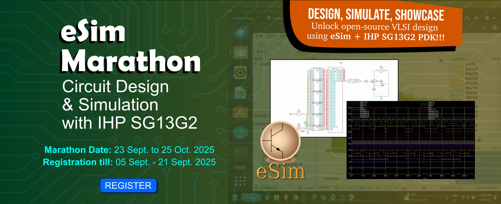

# Bandgap-Reference-Circuit
Bandgap Reference Circuit Design Using IHP 130nm BiCMOS Open Source PDK And eSim

### eSIM Marathon - Circuit Design & Simulation with IHP SG13G2


### Table of contents
  * [Abstract](#abstract)
  * [Tools Used](#tools-used)
  * [BGR Introduction](#bgr-introduction)

## Abstract
The design of 1V bandgap reference (BGR) circuit using silicon-germanium heterojunction bipolar transistor (SiGe-HBT) from IHP 130nm BiCMOS open source PDK. The circuit operates with temperature coefficient (TC) of 6.85ppm/ºC in the temperature range of -20ºC to 85ºC at 1.3V supply.

## Tools Used
### eSim:
eSim is an open source EDA tool for circuit design, simulation, analysis and PCB design, developed by FOSSEE Team at IIT Bombay. It is an integrated tool build using open source softwares such as KiCad, Ngspice and GHDL.</br>
Download Link: https://esim.fossee.in/downloads

### IHP Open Source PDK: 
130nm BiCMOS Open Source PDK, dedicated for Analog/Digital, Mixed Signal and RF Design.</br>
Download Link: https://github.com/IHP-GmbH/IHP-Open-PDK </br>
Installation Guide: https://ihp-open-pdk-docs.readthedocs.io/en/latest/install.html

### OpenVAF:
OpenVAF is a Verilog-A compiler that can compile Verilog-A files for use in circuit simulator.</br>
Download Link: https://openvaf.semimod.de/download

### NGSPICE: 
Ngspice is a mixed-level/mixed-signal circuit simulator. Its code is based on three open source software packages: Spice3f5, Cider1b1 and Xspice.</br>
Download Link: https://sourceforge.net/p/ngspice/ngspice/ci/master/tree </br>
Installation Guide: https://ihp-open-pdk-docs.readthedocs.io/en/latest/analog/ngspice.html

### GNU Octave:
GNU Octave is a scientific programming language for scientific computing and numerical computation.</br>
Download Link: https://octave.org/download 

## BGR Introduction
Bandgap regerence circuit (BGR) is a voltage reference circuit which generates constant voltage, independent of temperature, supply and process variation. This voltage composed of complementary to absolute temperature (CTAT) and proportional to  absolute temperature (PTAT) voltage and/or current components. Correct proportion of this components produce constant voltage. V<sub>BE</sub> and V<sub>T</sub> in the BJT current equation produces CTAT and PTAT voltages respectively.</br>
$$
V_BG = V_BE + MV_T
$$


## Circuit Schematic in eSim


## Circuit Calculations

## Netlist

## Simulations
### DC: Temperature Sweep 

```
--------------------------------------------------------------------------------
Index   tempcoff        
--------------------------------------------------------------------------------
0	6.856214e+00	
1	2.631005e+01	
2	5.119615e+01	
```
### DC: Supply Sweep

### NOISE: Noise Analysis

```
--------------------------------------------------------------------------------
Index   outreftotalnois inreftotalnoise 
--------------------------------------------------------------------------------
0	4.858997e-06	8.082027e-05	
1	7.119791e-06	1.215717e-04	
2	1.057774e-05	1.855346e-04	
```
### TRAN: Transient Analysis

### MC: Monte-Carlo Analysis


## Simulation Instructions
Before proceeding with simulation instructions, kindly install all the [tools used](#tools-used). Also check the $PDK_ROOT and $PDK path variable. If not set, do so.
```
echo $PDK_ROOT
echo $PDK
```
### STEP1: 
Open terminal and clone the git repository. Then change the working directory.
```
git clone https://github.com/Knavere29/Bandgap-Reference-Circuit.git
cd Bandgap-Reference-Circuit
```

### STEP2:
Run allSimRun.sh script in terminal. The script runs all the simulation one by one.
```
./allSimRun.sh 
```

### STEP3:
Change directory to simulationPlots to see the results.
```
cd simulationPlots
```

## Conclusion

## Author
Nagaraj Venkatesh Reddy </br>
Contact: nagarajvreddy29@gmail.com

## Acknowledgement
I would like to express my sincere gratitude to the organizers of the eSim Marathon, eSim team and the IHP team for providing this opportunity and support.

## References
1. J. M. Loché, A. Abarca, T. Darós, R. Wrege, C. Marques and J. Piteira, "A Low-Noise and Small-Area 0.9 V Bandgap Reference in Standard 180 nm CMOS Process for Neural Applications," 2025 IEEE 16th Latin America Symposium on Circuits and Systems (LASCAS), Bento Gonçalves, Brazil, 2025, pp. 1-5, doi: 10.1109/LASCAS64004.2025.10966327.
2. Wing-Hung Ki, "Design of Voltage References," International Solid-State Circuits Conference (ISSCC)
San Francisco, USA, Feb. 17, 2013. </br>
Link: https://www.nishanchettri.com/isscc-slides/2013%20ISSCC/TUTORIALS/ISSCC2013Visuals-T9.pdf
3. Holger Vogt, Giles Atkinson, Paolo Nenzi, "Ngspice User’s Manual Version 45".</br>
Link: https://sourceforge.net/projects/ngspice/files/ng-spice-rework/45.2/ngspice-45-manual.pdf/download
